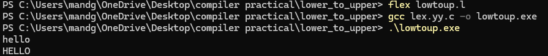
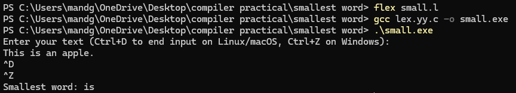
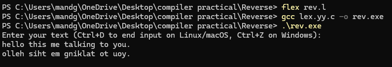

# COMPILER PRACTICAL

## 1 Write a program to convert lowercase to uppercase

output 1

## 2 Lex program to find the smallest word in an input text

output2

## 3 Revers all words in an input text

output 3

